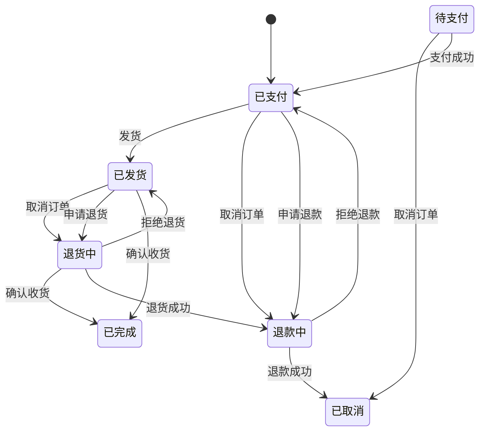

### fsm

状态机（Finite State Machine, FSM）是一种描述系统行为的数学模型，通过定义有限的状态、状态间的转换规则以及事件触发的动作，实现对复杂逻辑的清晰管理。以下从核心原理、类型、应用场景到实现方式展开详解：

### 🔍核心概念与原理
1. 四大要素
   - 状态（State）：系统在特定时刻的行为模式（如红绿灯的“红灯”“绿灯”）。
   - 事件（Event）：触发状态转换的条件（如按键按下、定时器超时）。
   - 转换（Transition）：事件导致的状态迁移路径（如从“待机”到“洗涤”）。
   - 动作（Action）：状态转换或进入/退出状态时执行的操作（如启动电机、发送数据）。
2. 工作原理  
系统始终处于唯一状态，事件发生时，根据`当前状态`+`输入事件`决定下一状态及动作
   - 例如自动门：状态“`关闭`” + 事件“`有人靠近`” → 转换到“`打开`”并执行开门动作。

### example
```go
package main

import (
	"github.com/general252/fsm"
	"log"
)

// 订单状态定义
const (
	StatePending   fsm.State = "待支付"
	StatePaid      fsm.State = "已支付"
	StateRefunding fsm.State = "退款中"
	StateShipped   fsm.State = "已发货"
	StateReturning fsm.State = "退货中"
	StateCanceled  fsm.State = "已取消"
	StateComplete  fsm.State = "已完成"
)

// 事件定义
const (
	EventPaySuccess     fsm.Event = "支付成功"
	EventApplyRefund    fsm.Event = "申请退款"
	EventRefuseRefund   fsm.Event = "拒绝退款"
	EventRefundSuccess  fsm.Event = "退款成功"
	EventCancel         fsm.Event = "取消订单"
	EventShip           fsm.Event = "发货"
	EventApplyReturn    fsm.Event = "申请退货"
	EventRefuseReturn   fsm.Event = "拒绝退货"
	EventReturnSuccess  fsm.Event = "退货成功"
	EventConfirmReceipt fsm.Event = "确认收货"
)

type eTo struct {
	F fsm.State
	E fsm.Event
	T fsm.State
}

func main() {
	log.SetFlags(log.LstdFlags | log.Lshortfile)
	fm := fsm.NewStateMachine(StatePending)

	var eTos = []eTo{
		{StatePending, EventCancel, StateCanceled},
		{StatePending, EventPaySuccess, StatePaid},
		{StatePaid, EventCancel, StateRefunding},
		{StatePaid, EventApplyRefund, StateRefunding},
		{StateRefunding, EventRefundSuccess, StateCanceled},
		{StateRefunding, EventRefuseRefund, StatePaid},
		{StatePaid, EventShip, StateShipped},
		{StateShipped, EventApplyReturn, StateReturning},
		{StateReturning, EventRefuseReturn, StateShipped},
		{StateReturning, EventReturnSuccess, StateRefunding},
		{StateShipped, EventConfirmReceipt, StateComplete},
		{StateShipped, EventCancel, StateReturning},
		{StateReturning, EventConfirmReceipt, StateComplete},
	}

	for _, e := range eTos {
		err := fm.AddTransitions(&fsm.Transition{
			From:  e.F,
			Event: e.E,
			To:    e.T,
			Handle: func(from fsm.State, e fsm.Event, to fsm.State) error {
				log.Printf("处理事件... [%v]->(%v)->[%v]", from, e, to)
				return nil
			},
		})
		if err != nil {
			log.Println(err)
			return
		}
	}

	// 执行事件测试
	log.Println("当前状态:", fm.CurrentState())
	_ = fm.Trigger(EventPaySuccess) // 支付成功
	log.Println("当前状态:", fm.CurrentState())

	_ = fm.Trigger(EventShip) // 发货
	log.Println("当前状态:", fm.CurrentState())

	_ = fm.Trigger(EventCancel) // 取消订单
	log.Println("当前状态:", fm.CurrentState())

	// 测试非法转移
	err := fm.Trigger(EventApplyReturn)
	log.Println("尝试:", err) // 非法操作

	_, _, diagram := fm.View()
	log.Println("\n" + diagram)
}

```




---
> [Finite State Machine for Go](https://github.com/looplab/fsm)  
> [状态机设计](https://juejin.cn/post/7513752860162129960)  
